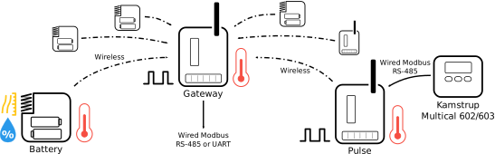
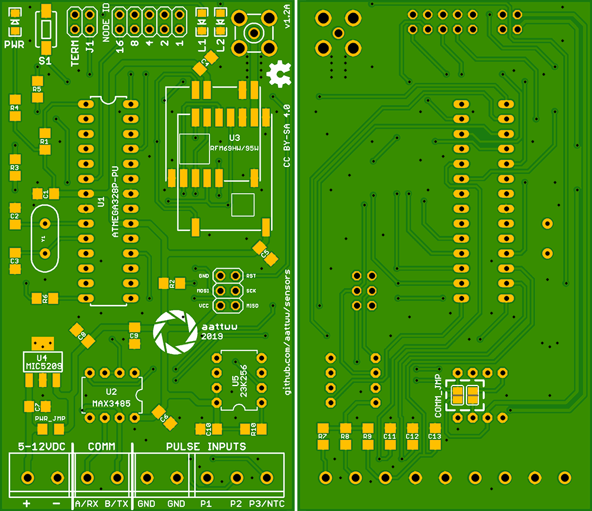

# Summary

This project consists of simple Atmel ATmega328P based nodes utilizing HopeRF LoRa RFM95W/RFM96W radios. Sensors supported by battery-powered nodes are Silicon Labs Si7021 for temperature and humidity, Bosch Sensortech BME280 for temperature, humidity and barometric pressure, and common NTC thermistor for temperature only. Externally powered pulse type nodes count pulses from different utility meters and also connect to Kamstrup Multical energy meters. Gateway receives and collects measurements from sensor nodes and can be accessed by serial communication using Modbus RTU protocol via either two-wire RS-485 or common 3.3 volt UART. This enables interfacing with many DIY home automation systems such as [Domoticz](https://www.domoticz.com/), [Home Assistant](https://www.home-assistant.io/) and [openHAB](https://www.openhab.org/). Sensors uses custom circuit boards but is programmed with Arduino IDE.

This project is a complete package: it includes both hardware designs and software. *Schematics* contains PCB designs so you can manufacture or order PCBs from a factory and solder the nodes. Software is ready to be uploaded as it is. If you do not want to use the hardware designs provided, you should be able to use, for example, Arduino Pro Minis with protoboards instead. Browse through the .inos and the schematics to find out pin definitions. Remember to take into account battery usage if using Pro Minis or other "full size" Arduinos. Also remember that the components used are mostly 3.3 volt tolerant only, so using a 5 volt Uno requires level shifting.

Skip directly to [Instructions](#instructions), although I strongly recommend reading the whole readme first.

# Table of Contents

* [External requirements](#external-requirements)
  * [Libraries](#libraries)
  * [Hardware package (core)](#hardware-package-core)
* [Gateway](#gateway)
  * [Modbus registers](#modbus-registers)
    * [Gateway specific registers](#gateway-specific-registers)
    * [Battery powered node specific registers](#battery-powered-node-specific-registers)
    * [Pulse node specific registers](#pulse-node-specific-registers)
    * [Pulse node with Kamstrup Multical 602 energy meter specific registers](#pulse-node-with-kamstrup-multical-602-energy-meter-specific-registers)
* [Node types](#node-types)
  * [Battery](#battery)
    * [Supported sensors](#supported-sensors)
  * [Pulse](#pulse)
  * [Pulse with Kamstrup Multical 602 energy meter](#pulse-with-kamstrup-multical-602-energy-meter)
* [Radios](#radios)
* [Schematics and PCB](#schematics-and-pcb)
  * [BOM](#bom)
    * [Gateway / Pulse / Pulse with Kamstrup Multical](#gateway--pulse--pulse-with-kamstrup-multical)
    * [Battery](#battery-1)
  * [LEDs](#leds)
    * [Gateway](#gateway-1)
    * [Battery](#battery-2)
    * [Pulse / Pulse with Kamstrup Multical](#pulse--pulse-with-kamstrup-multical)
  * [Headers and buttons](#headers-and-buttons)
    * [Gateway](#gateway-2)
    * [Battery](#battery-3)
    * [Pulse / Pulse with Kamstrup Multical](#pulse--pulse-with-kamstrup-multical-1)
* [Instructions](#instructions)
* [Version history](#version-history)

# External requirements

Sensors requires a few external components to work: libraries provide functions for radio communications and connected sensors while hardware package handles needed fuses to work with custom boards used by Sensors. Follow carefully especially the instructions regarding RadioHead and Cryptography libraries, as these require a couple of underlying changes.

## Libraries

**RadioHead Packet Radio library for embedded microprocessors** provides support for RFM95W/RFM96W radios (and many others as well). Download from [airspayce.com](https://www.airspayce.com/mikem/arduino/RadioHead/). After extracting the library to your Arduino IDE libraries folder you will have to do one adjustment. In the beginning of *RadioHead/RH_RF95.h* change line  
`#define RH_RF95_FIFO_SIZE 255`  
to  
`#define RH_RF95_FIFO_SIZE 100`  
Communication will not work without this change. You also risk running out of SRAM without this adjustment.

**Arduino Cryptography Library** includes support for encryption. If you do not plan to encrypt traffic, you will not need this library. Download from [github.com](https://github.com/rweather/arduinolibs). You will need to download the ZIP and extract contents of *libraries* to your Arduino IDE libraries folder. Also remember to uncomment the following line at the very end of *RadioHead/RadioHead.h* to enable encryption:  
`//#define RH_ENABLE_ENCRYPTION_MODULE`  
You will also need to disable watchdog entropy harvesting by commenting out the following line at the beginning of *Crypto/RNG.cpp* because watchdog timer is already used by battery powered nodes:  
`#define RNG_WATCHDOG 1      // Harvest entropy from watchdog jitter.`  
If you are overwhelmed by all this, you may just want not to enable encryption at all. After all, Sensors is not exactly high security system anyway.

**LowPowerLab SI7021** library is needed to work with Silicon Labs Si7021 temperature and humidity sensor. Download from [github.com](https://github.com/LowPowerLab/SI7021).

**SparkFun BME280 Arduino Library** interfaces with Bosch Sensortech BME280 temperature, humidity and barometric pressure sensor. Documentation at [github.com](https://github.com/sparkfun/SparkFun_BME280_Arduino_Library). Install using Arduino IDE Library Manager.

## Hardware package (core)

Sensors uses a bit different hardware design than regular Arduino boards. For example, battery operated nodes run on internal 1 MHz clock and gateway uses external 8 MHz crystal. They also lack bootloader (although you could use it, hardware just doesn't provide serial pins to burn new firmware using bootloader anyway). Instead, program is flashed using ICSP through ISP header.

You could set the necessary fuses manually but it is considerably easier to just use a ready-made hardware package. MCUdude has a nice core specifically to do this. Download MCUdude's MiniCore from [github.com](https://github.com/MCUdude/MiniCore).

# Gateway

Gateway collects data from nodes and acts as an relay to a [Modbus](https://en.wikipedia.org/wiki/Modbus) network. By using Maxim Integrated MAX3485 RS-485 transceiver gateway can be connected to an existing RS-485 Modbus RTU network as a slave. Omitting the transceiver provides a direct TTL serial port. This can be accessed with, for example, another Arduino board, FTDI chip or connected directly to a Raspberry Pi. Regardless of the physical connection, gateway is accessed using Modbus protocol. Gateway requires regulated 3.3 volts or (unregulated) 5-12 volts DC power supply. In addition, gateway has three pulse inputs (pulse values are periodically saved to EEPROM and restored on power-up), one of which can be used as an NTC thermistor input. These inputs are also accessible via Modbus.

**Warning:** UART serial port is 3.3 volts, so don't connect it to a 5 volt system.

Why Modbus? Modbus is an easy to use and integrate protocol for this kind of data transfer. Although it is old and somewhat limited in features, it still provides all the necessary things and is widely used in industry. Libraries to access it exist for more or less every platform. Also, most DIY home automation systems ([Home Assistant](https://www.home-assistant.io/), [Domoticz](https://www.domoticz.com/) and [openHAB](https://www.openhab.org/) to name a few) have Modbus support.

## Modbus registers

Registers can be accessed using either function code 3 (read holding registers) or 4 (read input registers). Both return the same register values. Note that registers not defined can not be read. For example, trying to read registers 20-99 or 108-199 will return *illegal data address exception*.

### Gateway specific registers

| Address | Number | Name | Type / Unit | Notes |
| ------- | ------ | ---- | ---- | ----- |
| 0       | 30001  | Modbus errors (CRC failed or corrupted) | Counter |  |
| 1       | 30002  | Modbus overflown frames | Counter |  |
| 2       | 30003  | Modbus illegal function reads | Counter |  |
| 3       | 30004  | Modbus illegal address reads | Counter |  |
| 4       | 30005 | Modbus frames received | Counter |  |
| 5       | 30006  | Modbus frames sent | Counter |  |
| 6       | 30007  | Nodes during last hour | Counter |  |
| 7       | 30008  | Nodes during last 12 hours | Counter |  |
| 8       | 30009  | Nodes during last 24 hours | Counter |  |
| 9       | 30010  | At least one node low on battery | Boolean |  |
| 10       | 30011  | Gateway out of memory | Boolean |  |
| 11       | 30012  | Gateway uptime | Hour | |
| 12       | 30013  | Firmware version | | 8 MSB = major, 8 LSB = minor |
| 13       | 30014  | Status |  | See below for bits. |
| 14       | 30015  | Pulse 1 | Counter | 32 bit |
| 16       | 30017  | Pulse 2 | Counter | 32 bit |
| 18       | 30019  | Pulse 3 / Temperature | Counter / °C | 32 bit |

Status register bits (from LSB to MSB):
* Bit 0 **External SRAM:** *1* if gateway has external SRAM, *0* if using internal SRAM. Affects maximum number of nodes, see notes in [Schematics and PCB](#schematics-and-pcb).
* Bit 1-15 **Reserved**

### Battery powered node specific registers

First address is *node id * 100*. For example, this table shows addresses for a node id 1. Similarly, measurements for node id 2 start at address 200, and so on.

| Address | Number | Name | Type / Unit | Notes |
| ------- | ------ | ---- | ---- | ----- |
| 100       | 30101  | Last received | Minute | When was node last seen. |
| 101       | 30102  | Battery voltage | mV | Current battery voltage. |
| 102       | 30103  | Transmit power | % | Relative transmit power. |
| 103       | 30104  | Transmit interval | Minute | How often the node transmits at least. |
| 104       | 30105  | Header |  | Only 8 LSB, debug data. |
| 105       | 30106  | Temperature | °C | ×10 |
| 106       | 30107  | Relative humidity | RH% | ×10. **Only if node has Si7021 or BME280.** |
| 107       | 30108  | Barometric pressure / Temperature | hPa / °C | ×10. **Pressure if node has BME280, temperature if node has both Si7021 and NTC.** |

### Pulse node specific registers

First address is *node id * 100*. For example, this table shows addresses for a node id 2. Similarly, measurements for node id 3 start at address 300, and so on.

| Address | Number | Name | Type / Unit | Notes |
| ------- | ------ | ---- | ---- | ----- |
| 200       | 30201  | Last received | Minute | When was node last seen. |
| 201       | 30202  | Transmit power | % | Relative transmit power. |
| 202       | 30203  | Transmit interval | Minute | How often the node transmits at least. |
| 203       | 30204  | Header |  | Only 8 LSB, debug data. |
| 204       | 30205  | Pulse 1 | Counter | 32 bit |
| 206       | 30207  | Pulse 2 | Counter | 32 bit |
| 208       | 30209  | Pulse 3 / Temperature | Counter / °C | 32 bit |

### Pulse node with Kamstrup Multical 602 energy meter specific registers

First address is *node id * 100*. For example, this table shows addresses for a node id 3. Similarly, measurements for node id 4 start at address 400, and so on.

| Address | Number | Name | Type / Unit | Notes |
| ------- | ------ | ---- | ---- | ----- |
| 300       | 30301  | Last received | Minute | When was node last seen. |
| 301       | 30302  | Transmit power | % | Relative transmit power. |
| 302       | 30303  | Transmit interval | Minute | How often the node transmits at least. |
| 303       | 30304  | Header |  | Only 8 LSB, debug data. |
| 304       | 30305  | Pulse 1 | Counter | 32 bit |
| 306       | 30307  | Pulse 2 | Counter | 32 bit |
| 308       | 30309  | Pulse 3 / Temperature | Counter / °C | 32 bit |
| 310       | 30311  | Heat energy | kWh | 32 bit |
| 312       | 30313  | Actual flow | l/h | 32 bit |
| 314       | 30315  | Volume | m³ | ×100. 32 bit |
| 316       | 30317  | Actual power | kW | ×10. 32 bit |
| 318       | 30319  | Actual t₁ | °C | ×100. 32 bit |
| 320       | 30321  | Actual t₂ | °C | ×100. 32 bit |

# Node types

Sensors includes two main types of nodes: battery and pulse. Battery-powered low-power nodes monitor temperature, humidity and pressure. Pulse type nodes are externally powered and count pulses from utility meters. Pulse nodes also support connecting one NTC thermistor for temperature monitoring and RS-485 Modbus RTU. The latter enables the node to be connected to a Kamstrup Multical 602 energy meter.

## Battery

Battery powered sensors provide simple nodes to monitor temperature, humidity and barometric pressure. These nodes operate on two normal 1.5 volt AA alkaline batteries. If longer lifetime is needed or if node is placed in cold environment, more expensive 1.5 volt AA-size lithium batteries can also be used.

**Warning:** Hardware provides no reverse voltage protection in order to conserve power and to keep number of parts minimal, so **make sure to observe polarity when inserting batteries or you will destroy the node**.

Nodes spend most of the time sleeping, only to wake up to take measurements and send values to gateway. Frequency can be controlled through settings at the beginning of the code file. In threshold mode, nodes wake up periodically and take measurements. If values differ enough from previously sent ones, a message is sent. If not, nodes return to sleep. However, there is a specific force time controlling how often a new message is sent at least regardless of threshold. If a node is not operating in threshold mode, it will send a message every time it wakes up.

### Supported sensors

Nodes support three types of sensors: Silicon Labs Si7021, Bosch Sensortech BME280, and a common NTC thermistor. The first one has temperature and humidity, the second one adds barometric pressure, and the latter provides only temperature. A node can have only one kind of sensor, or as a special case both Si7021 and NTC at the same time. PCB provides footprints for all, and the exact type is defined in runtime. That is, every node is flashed with the same software and it checks at bootup what kind of sensor configuration is connected.

**Si7021** sensors can be bought as breakout boards from eBay and similar places for a couple of dollars. When buying the sensor, get one that does not include voltage regulator and I2C level shifting. Battery powered nodes operate on 3.3 volts so Si7021 can be fed directly. Not having (unnecessary) regulator saves battery power. For example, [this one](https://www.ebay.com/itm/SMD-MINI-Si7021-Temperature-and-Humidity-Sensor-I2C-Interface-for-Arduino/264394330907) is recommended, while [this one](https://www.ebay.com/itm/Si7021-Industrial-High-Precision-Humidity-Sensor-I2C-Interface-for-Arduino/201539848414) is not.

**BME280** sensors are also available in eBay, Aliexpress and similar as breakout boards. They are a bit more expensive. These seem not to be available without the onboard regulator, so if you want to lower power consumption, your only option is to remove the regulator. Example image of a removed regulator [shown here](images/bme280.jpg). [This sensor](https://www.ebay.com/itm/Breakout-Temperature-Humidity-Barometric-Pressure-BME280-Digital-Sensor-Module/401000227934), for example, has been used successfully.

**Note:** Chinese sellers sometimes mix the BME280 with earlier and less featured BMP280. Be careful when buying the sensor. Info about this for example [here](https://goughlui.com/2018/08/05/note-bosch-sensortec-bmp280-vs-bme280-sensor-confusion/) and [here](https://www.meteocercal.info/forum/Thread-Bosch-Sensortec-BMP280-vs-BME280-Sensor-Confusion).

**NTC thermistors** can be purchased from the same places as the other sensors. When buying thermistors, make sure you get three necessary values: *nominal resistance*, *nominal temperature* and *beta coefficient*. For example, [this thermistor](https://www.ebay.com/itm/5PCS-1m-NTC-Thermistor-accuracy-temperature-sensor-10K-1-3950-Waterproof-Probe/311572298670) has been successfully used and works with the default values.

## Pulse

Pulse type nodes are intended to measure pulses from a water, electricity, gas or other kind of meter with pulse output. Nodes have three pulse inputs, one of which can be used as an NTC thermistor input instead of a pulse input. Pulse inputs are pulled high internally by microcontroller or with optional external resistors, and connected meter pulls it low to ground. Pulse values are periodically saved to EEPROM and restored on power-up. Pulse nodes require either regulated 3.3 volts or (unregulated) 5-12 volts DC power supply. They use the same PCB as the gateway.

## Pulse with Kamstrup Multical 602 energy meter

These nodes are regular pulse nodes with added support for Kamstrup Multical 602 energy meter. Node is connected by RS-485 to a Multical 602 energy meter and periodically reads certain values from the meter. See Modbus register listing above for these values.

**Note:** Multical 602 seems to be discontinued and replaced by Multical 603. According to datasheet, Multical 603 supports the same Modbus registers as the old 602. Therefore nodes should work with newer 603s but this is untested.

**Protip:** Using this node as an example, it should be quite easy to connect some other kind of Modbus RTU capable device to a Pulse type node and adjust code accordingly. This way you can read any other Modbus meters or devices via Sensors nodes.

# Radios

Sensors utilize HopeRF RFM95W and RFM96W LoRa radios. RFM95W is for 868/915 MHz and RFM96W for 433 MHz. These are cheap low power radios with very good range. Battery nodes use wire or helical antennas, while gateway and pulse nodes have SMA connectors for better performing antennas. Please consider local regulations when choosing frequency range, bandwidth, transmit power and other radio related settings. Nodes automatically adjust transmit power to the lowest possible level.

Attainable range depends greatly on numerous things but personally I have easily achieved over one kilometer through a reinforced concrete wall and a metal facade. This was between a gateway with a dipole SMA antenna and a battery node with helical antenna. The same setup also reached over 200 meters through buildings in a more built environment. However, as with wireless communication in general, your results will vary.

**Note:** On the PCB there is footprint for older HopeRF RFM69HW radio as well. It should work, but it has not been tested and there is currently no support in software for this. Feel free to create a new branch and implement it.

# Schematics and PCB

Following is the table of bill of materials. Not all components are needed, see the notes below for these parts. Majority of the SMD components are 1206 package for easier hand soldering. Gateways and pulse nodes share the same PCB.

Some notes:
* MAX3485 transceiver is needed only if you connect the gateway to an existing RS-485 network. If you use direct UART it is not needed. In this case, remember to also short *COMM_JMP* at the bottom.
* External pull-up resistors are probably not needed in most cases as internal ones in ATmega328P are usually adequate. However, if you are connecting NTC thermistor to pulse 3, remember to solder the 10 kOhm series resistor.
* Pulse smoothing capacitors are optional. Use them if you encounter erroneous pulses, ie. too many pulses are counted. For example, I had a [rain gauge](https://www.amazon.co.uk/dp/B00QDMBXUA) connected to a pulse input with a rather long cable (about 10 meters running next to mains power supply for part of length). Extra pulses were counted even when no rain had fallen. Adding a 10 uF capacitor removed these wrong measures.
* MIC5209 regulator makes it possible to power the gateway/pulse node with DC voltage between 5-12 volts (technically up to 16 volts but it might start to get warm). If you can supply the board with regulated 3.3 volts, you can omit the regulator. In this case, also short the *PWR_JMP*.
* The Microchip 23K256 SRAM chip is optional. Without it, gateway falls back using its internal SRAM. However, this severely limits the amount of nodes. With the 23K256 gateway supports 100 nodes regardless of type, without it only 10. This varies by node type, however. For example, without external SRAM gateway supports 10 battery nodes, or 5 pulse nodes, or 6 battery nodes plus 2 pulse nodes.
* SMA connector can be omitted and replaced with a wire or a helical antenna if these smaller gain antennas are sufficient. You can also, with some very careful alignment, solder a u.FL connector on to the SMA connector footprint. This allows using a u.FL to SMA pigtail to move the actual SMA connector away.

I have successfully ordered PCBs from Seeed Studio. You can get boards for 10 gateways/pulse nodes and 10 battery nodes for $9.80 plus postage. Of course any prototype PCB factory will work. PCBs are designed not to have any tight spacings or need for strict tolerances. For gateway and pulse node, select 1.6mm thickness (the enclosure will hold the PCB better). With battery nodes, boards can be thinner (for example 1.2mm works well). Other options should be okay with defaults.

Boards are designed to fit the enclosures mentioned in the table. [Bud Industries DMB-4771](https://www.budind.com/view/Plastic+Boxes/DIN+Rail+Mount+Multi-Board+Box) is a 35mm DIN rail mounted box, while [Supertronic PP42](http://www.supertronic.com/en/cajas_de_plastico/sensors/29/pp42/50) is a simple wall mounted enclosure (use double-sided tape). In the *schematics* folder there is also *AP9_holder.stl* which is a 3D model of a simple holder to fix a battery node into an [ABB AP9 junction box](https://new.abb.com/products/2TKA140012G1/ap9-junction-box-ip65). This is especially handy if you install a node outside and have access to a 3D printer. You will need two holders and a set of small screws. You will also need to have a way to make the box rain-proof but still let humidity and temperature in. Poking some holes into membrane cable entries is one way, or if you want to go professional, use a sintered protective cover. [This](https://www.ebay.com/itm/Protective-Cover-SHT10-SHT20-Soil-Temperature-Humidity-Moisture-Sensor-Shell/173940209491) has been proven to work: a BME280 breakout board will *just* fit inside if you solder wires to the board as [shown here](images/bme280.jpg). Remember to wrap the breakout board (but not the sensor itself) with some insulating tape or use heat shrink to prevent short circuits. [This image](images/si7021_wired.jpg) shows an Si7021 breakout board prepared for outdoor sensor use. You will also need to drill off the plastic inside with the connectors of the protective cover. Use some imagination here. A ready-made weatherproofed sensor looks something like [this](images/weatherproof_node.jpg).

## BOM

### Gateway / Pulse / Pulse with Kamstrup Multical

| Part | Value | Device | Package | Type | Notes |
| ---- | ----- | ------ | ------- | ---- | ----- |
| C1 | 100 nF | Decoupling capacitor | 1206 | Ceramic | |
| C2 | 22 pF | Crystal capacitor | 1206 | Ceramic | |
| C3 | 22 pF | Crystal capacitor | 1206 | Ceramic | |
| C4 | 100 nF | Decoupling capacitor | 1206 | Ceramic | Used only with RFM95W / RFM96W. |
| C5 | 100 nF | Decoupling capacitor | 1206 | Ceramic | Used only with RFM69HW. |
| C6 | 100 nF | Decoupling capacitor | 1206 | Ceramic | Used only with U2 (MAX3485). |
| C7 | 1 uF | Power input capacitor | 1206 | Tantalum | |
| C8 | 1 uF | Power output capacitor | 1206 | Tantalum | |
| C9 | 10 uF | Power output capacitor | 1206 | Ceramic | |
| C10 | 100 nF | Decoupling capacitor | 1206 | Ceramic | Used only with 23K256. |
| C11 | Depends | Pulse 3 smoothing capacitor | 1206 | Ceramic | Use if erroneous pulses are counted. |
| C12 | Depends | Pulse 2 smoothing capacitor | 1206 | Ceramic | Use if erroneous pulses are counted. |
| C13 | Depends | Pulse 1 smoothing capacitor | 1206 | Ceramic | Use if erroneous pulses are counted. |
| R1 | 10 kOhm | Reset pull-up resistor | 1206 | | |
| R2 | 10 kOhm | Radio slave select pull-up resistor | 1206 | | |
| R3 | 120 Ohm | RS-485 termination resistor | 1206 | | Used only with U2 (MAX3485). |
| R4 | Depends | Power LED resistor | 1206 | | Select value based on LED in use. |
| R5 | Depends | Activity LED resistor | 1206 | | Select value based on LED in use. |
| R6 | Depends | Serial activity LED resistor | 1206 | | Select value based on LED in use. |
| R7 | Depends / 10 kOhm | Pulse 3 pull-up / NTC series resistor | 1206 | | Use if ATmega328P internal pull-up resistor is not strong enough, or NTC is to be used. |
| R8 | Depends | Pulse 2 pull-up resistor | 1206 | | Use if ATmega328P internal pull-up resistor is not strong enough. |
| R9 | Depends | Pulse 1 pull-up resistor | 1206 | | Use if ATmega328P internal pull-up resistor is not strong enough. |
| R10 | 10 kOhm | SRAM slave select pull-up resistor | 1206 | | Used only with 23K256. |
| D1 | | Serial activity LED | 1206 | | |
| D2 | | Power LED | 1206 | | |
| D3 | | Activity LED | 1206 | | |
| Y1 | 8 MHz | HC-49US 8 MHz crystal | | | |
| S1 | | Momentary push button | 3x6 mm | | For example, [this one](https://www.ebay.com/itm/100-Pcs-3x6x2-5mm-Momentary-Tact-SMD-SMT-Push-Button-Micro-Switch-2-Pin/272961316148). |
| X1 | | SMA connector | | | For example, [this one](https://www.ebay.com/itm/End-Launch-PCB-Mount-SMA-Female-Plug-Straight-RF-Connector-Adapter-10-Pcs-R7Z6-/253508669169). |
| Header | | ISP programming header | 2x3, 0.1" pitch | | |
| Header | | Node ID selection header | 2x5, 0.1" pitch | | |
| Header | | RS-485 terminate and J1 header | 2x2, 0.1" pitch | | |
| Screw terminals | | Power, serial, pulse grounds, pulse inputs | 3x2 + 1x3, 5.08mm pitch | | For example, [two terminal](https://www.ebay.com/itm/20PCS-KF301-2P-2-Pin-Plug-in-Terminal-Block-Connector-5-08mm-Pitch-Through-Hole/381374540897) and [three terminal](https://www.ebay.com/itm/10pcs-KF301-3P-5-08mm-Blue-Connect-Terminal-Blue-Screw-Terminal-Connector/201415082308). |
| PWR_JMP | | Solder jumper | 1206 | | Short or use a zero-ohm resistor if not using U4, i.e. board is provided external regulated 3.3 volts. |
| COMM_JMP | | Solder jumper | | | Short if not using U2, i.e. direct UART is used. |
| U1 | | Atmel ATmega328P microcontroller | DIP-28 | | Preferably use a socket. |
| U2 | | Maxim MAX3485 RS-485 transceiver | DIP-8 | | Preferably use a socket. Use only if connected to an RS-485 network. |
| U3 | | HopeRF RFM95W/RFM96W/RFM69HW | | | |
| U4 | | Microchip MIC5209-3.3 regulator | SOT-223 | | Optional (see notes above). |
| U5 | | Microchip 23K256 SRAM | DIP-8 | | Optional (see notes above). Preferably use a socket. |
| Enclosure | | Bud Industries DMB-4771 | | | |

### Battery

| Part | Value | Device | Package | Type | Notes |
| ---- | ----- | ------ | ------- | ---- | ----- |
| C1 | 100 nF | Decoupling capacitor | 1206 | Ceramic | |
| C2 | 100 nF | Decoupling capacitor | 1206 | Ceramic | Used only with RFM69HW. |
| C3 | 100 nF | Decoupling capacitor | 1206 | Ceramic | Used only with RFM95W / RFM96W. |
| C4 | 100 nF | Power smoothing capacitor | 1206 | Ceramic | |
| C5 | 10 uF | Power smoothing capacitor | 1206 | Ceramic | |
| C6 | 100 nF | Decoupling capacitor | 1206 | Ceramic | |
| R1 | Depends | Activity LED resistor | 1206 | | Select value based on LED in use. |
| R2 | 10 kOhm | Reset pull-up resistor | 1206 | | |
| R3 | 10 kOhm | NTC series resistor | 1206 | | Use only with NTC. |
| R4 | 10 kOhm | Radio slave select pull-up resistor | 1206 | | |
| D1 | | Activity LED | 1206 | | |
| S1 | | Momentary push button | 3x6 mm | | For example, [this one](https://www.ebay.com/itm/100-Pcs-3x6x2-5mm-Momentary-Tact-SMD-SMT-Push-Button-Micro-Switch-2-Pin/272961316148). |
| Antenna | | Antenna for frequency in use, helical or wire | | | For example, [this one](https://www.ebay.com/itm/10PCS-868MHz-Helical-Antenna-2-15dBi-13mm-HPD215T-B-868MHZ-Stable-Remote-Contorl/311598709972). |
| Header | | ISP programming header | 2x3, 0.1" pitch | | |
| Header | | Node ID selection header | 2x6, 0.1" pitch | | |
| Header | | J1 header | 1x2, 0.1" pitch | | |
| U1 | | Atmel ATmega328P microcontroller | DIP-28 | | Preferably use a socket. |
| U2 / U3 | | Si7021 / BME280 sensor | | | Two footprints for different pin orders. See [Supported sensors](#supported-sensors) for more info. |
| U4 | | HopeRF RFM95W/RFM96W/RFM69HW | | | |
| NTC | | NTC thermistor | | | Header provided. See [Supported sensors](#supported-sensors) for more info. |
| Battery holder | | Holder for two AA size batteries | | | For example, a pair of [these](https://www.ebay.com/itm/AA-1-5V-PP3-Battery-or-Open-with-Switch-Holder-AA-x-1-Holder-PCB-Amount-5-C6T2-/283528370571). |
| Enclosure | | Supertronic PP42 | | | |

## LEDs

Boards have a few onboard LEDs to indicate different events. This chapter describes these events. All boards will blink the current running firmware version after power-up.

### Gateway

*PWR* is lit whenever gateway is powered. *L2* blinks when gateway is transmitting in Modbus network. The following table concerns *L1*.

| Blinks | Interval | Description | During | Notes |
| ------ | -------- | ----------- | ------ | ----- |
| 1 | 2 sec. | Illegal ID set. | Startup | Check ID headers and reboot. |
| 5 | 2 sec. | Failed to initialize radio. | Startup | Check connections. |
| 1 | - | Received and saved a message from a node. | Operation |  |
| 2 | - | Received a message from a node but memory is full. | Operation | Add external SRAM or lower amount of nodes. |
| 3 | - | Successful Modbus read from master. | Operation |  |
| 4 | - | Failed Modbus read from master. | Operation |  |

### Battery

Battery nodes have only one LED.

| Blinks | Interval | Description | During | Notes |
| ------ | -------- | ----------- | ------ | ----- |
| 1 | 2 sec. | Illegal ID set. | Startup | Check ID headers and reboot. |
| 3 | 2 sec. | Failed to initialize a proper sensor configuration. | Startup | Check connections. |
| 5 | 2 sec. | Failed to initialize radio. | Startup | Check connections. |
| 1 | - | Successful transmit. | Operation | Only in debug mode or forced transmit. |
| 2 | - | Failed transmit. | Operation | Only in debug mode or forced transmit. |

### Pulse / Pulse with Kamstrup Multical

Pulse nodes share the same board as gateway so they also have three LEDs. *PWR* is lit whenever node is powered. *L2* blinks when node is transmitting in Modbus network. The following table concerns *L1*. Unlike in battery nodes, in pulse nodes *L1* blinks always as they are not limited by battery.

| Blinks | Interval | Description | During | Notes |
| ------ | -------- | ----------- | ------ | ----- |
| 1 | 2 sec. | Illegal ID set. | Startup | Check ID headers and reboot. |
| 5 | 2 sec. | Failed to initialize radio. | Startup | Check connections. |
| 1 | - | Successful transmit. | Operation |  |
| 2 | - | Failed transmit. | Operation |  |
| 3 | - | Successful Modbus read. | Operation |  |
| 4 | - | Failed Modbus read. | Operation |  |

## Headers and buttons

Boards have a couple of user settable headers. These need to be set before boards are powered. Each device also has one button.

### Gateway

**TERM** is 120 Ohm RS-485 termination resistor. Short if the gateway is in the very end of a long RS-485 line.

**J1** is currently not in use.

**NODE ID** sets 5 bit Modbus slave address.

**Button** is currently not in use.

### Battery

**J1** puts a node in *debug mode*. In this mode, the node sends new values every 8 seconds with full power and also blinks the LED indicating success. Do not use in long-term as this will drain batteries quickly.

**NODE ID** sets 6 bit address in radio network. Every node has to have a unique address.

**Button** triggers instant send with full power and blinks the LED indicating success. Use to quickly test if the node is within gateway's range.

### Pulse / Pulse with Kamstrup Multical

**TERM** is 120 Ohm RS-485 termination resistor. Short if the gateway is in the very end of a long RS-485 line.

**J1** puts a node in *debug mode*. In this mode, the node sends new values every 8 seconds with full power. Do not use in long-term as this will unnecessarily congest radio network.

**NODE ID** sets 5 bit address in radio network. Every node has to have a unique address.

**Button** triggers instant send with full power. Use to quickly test if the node is within gateway's range.

# Instructions

## 1. Solder boards

Refer to [Schematics and PCB](#schematics-and-pcb) for detailed instructions for manufacturing boards. All the chips are through hole packages for easier hand soldering. Smaller components are mostly SMD but they are sufficiently large so that even unexperienced solderers should be able to hand solder them.

## 2. Download this repository

Download the repository. Place the contents of *libraries* to your Arduino libraries folder. Also copy *SensorsGateway*, *SensorsBattery* and *SensorsPulse* folders to your Arduino sketchbook.

## 3. Install hardware package

You can easily install *MiniCore* using *Boards Manager* in Arduino IDE. Follow instructions on [MiniCore's page](https://github.com/MCUdude/MiniCore#how-to-install).

## 4. Install external libraries

Install all the necessary external libraries. Refer to [Libraries](#libraries) section to further instructions. Pay extra attention to the part regarding cryptographic library if you are using encryption.

## 5. Adjust settings

In the beginning of each .ino there is a section containing all the necessary settings with good explanations. Adjust the settings as needed. Remember that frequency, encryption key and low rate have to match on every device in the same network or communication will not work.

## 6. Burn fuses

Since Sensors uses very different hardware than ordinary Arduino boards, microcontrollers have to be programmed with some special settings. To do this, you will need an external AVR ISP programmer. Luckily, you can also use another Arduino (Uno or Pro Mini, for example) if you don't have a dedicated ISP programmer available. Follow instructions at [Arduino.cc](https://www.arduino.cc/en/tutorial/arduinoISP) for wiring and burning the ArduinoISP sketch. There is just one catch: whatever you use to program a new board **has to be 3.3 volts**. ATmega328P is fine with 5 volts, but all other components work at 3.3 volts so supplying the board with 5 volts will most likely burn some or all components. What I suggest is a 3.3 volt version of Arduino Pro Mini or Pro Micro.

Follow the previously mentioned instructions until you hit *Program the bootloader*. In *Tools > Board* and under *MiniCore* select *ATmega328*. Select other options as follows:
* Clock: *1 MHz internal* for battery node, *8 MHz external* for all others
* BOD: *1.8v* for battery node, *2.7v* for others
* Variant: *328P / 328PA*
* Compiler LTO: *LTO enabled*
* Bootloader: *No bootloader*
* Port: Serial port where the programmer Arduino is connected to
* Programmer: *Arduino as ISP*

Next, hit *Burn Bootloader*. This doesn't actually burn any bootloader since we selected not to use a bootloader, it will only burn the necessary fuses. Keep the two boards still connected since next we will upload the sketch.

> **Note:** This has to be done only once with every new microcontroller. If you later change sketch settings and upload the new sketch, you can skip step 6 and follow directly step 7.

## 7. Uploading code

With still the two boards connected, Arduino IDE board settings as described in step 6 and the actual sketch open, just hit *Upload*. This will upload the sketch like any other Arduino sketch. After this, you are done.

## 8. Place the sensors

Place your gateway to a central location and connect it to a Modbus capable network. Using the jumper headers, set its Modbus slave address and apply power.

Distribute other nodes as needed, selecting first their addresses with jumper headers and then connecting external power or batteries. Use the button on the nodes to force a transmit with full power - normally nodes adjust their transmit power automatically to the lowest possible level. One blink of the onboard LED indicates a successful transmit, two blinks a failed one. LED blinks only when forcing a transmit with the button. You can use the provided Python script [*read_modbus.py*](read_modbus.py) to read data from the gateway for debugging purposes.

Start logging measurements to a MySQL database ([*save_modbus_to_db.py*](save_modbus_to_db.py) provides a starting point for this), for example, and graph it with [Grafana](https://grafana.com/), or connect the gateway to a home automation hub and monitor measurements that way.

# Version history

## v1.0.1 (2019-12-29)

* Fixed a bug in NTCSensor library where enable pin was controlled even though it was not in actual use, possibly interfering with serial communication.

## v1.0.0 (2019-12-26)

Initial public release.
